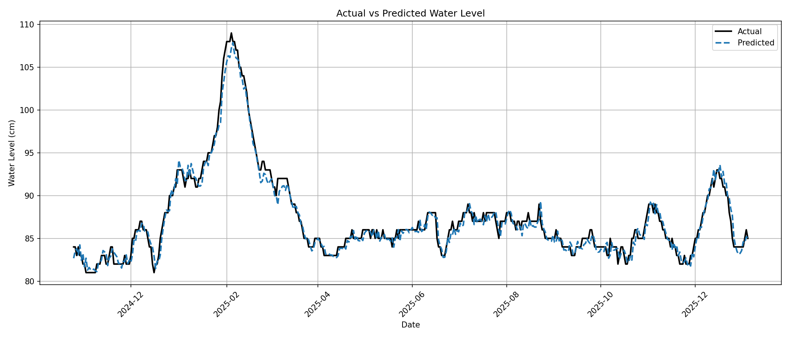
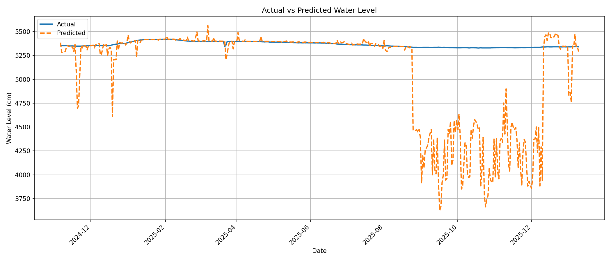

# 🌊 Lake Water Level Prediction in Sweden

This project implements an **end-to-end machine learning system** for predicting **daily water levels in lakes and water bodies across Sweden**.  
It combines **official hydrological observations from SMHI** with **historical and forecast weather data from Open-Meteo**, and uses a **feature-store-driven ML pipeline** to train, evaluate, and deploy models for multiple lake stations.

---

🚀 **Live ML Project Frontend:**  
👉 **https://hydrologyml.vercel.app/**

---

## 📌 Project Overview

- **Goal**: Predict future daily water levels (cm) for Swedish lakes
- **Approach**:
  - Historical water level observations from **SMHI**
  - Weather features from **Open-Meteo**
  - Lagged, aggregated, and spatial weather features
  - Tree-based regression models (per lake)
  - Batch inference with forecast weather
- **Scope**: Multi-station, production-oriented ML pipeline

---

## 📊 Data Sources

### 🌊 Water Level Observations
- **Provider**: Swedish Meteorological and Hydrological Institute (SMHI)
- **Data**: Daily lake and river water levels (cm)
- **Source**:  
  https://www.smhi.se/data/hitta-data-for-en-plats/ladda-ner-observationer-fran-sjoar-och-vattendrag

### 🌦️ Weather Data
- **Provider**: Open-Meteo
- **Historical weather**: Archive API
- **Forecast weather**: Forecast API
- **Website**: https://open-meteo.com/

---

## 🧠 Feature Engineering

### Water Level Features
- `water_level_cm`
- `water_level_cm_t_1`
- `water_level_cm_t_3`
- `water_level_cm_t_7`
- `water_level_cm_t_14`

### 🌦️ Weather Features

#### Local Weather
- `precipitation_sum`
- `snowfall_sum`
- `rain_sum`
- `temperature_2m_mean`
- `wind_speed_10m_mean`
- `surface_pressure_mean`

#### Aggregated Weather
- `precip_sum_3d`
- `precip_sum_7d`
- `precip_sum_14d`
- `snow_sum_14d`
- `snow_sum_30d`
- `snow_sum_60d`

#### Spatial Weather (75 km offsets)

For each direction **N / S / E / W**:
- `precipitation_sum_{d}_75km`
- `snowfall_sum_{d}_75km`
- `rain_sum_{d}_75km`
- `temperature_2m_mean_{d}_75km`
- `wind_speed_10m_mean_{d}_75km`
- `surface_pressure_mean_{d}_75km`

---

## 🏗️ ML Pipeline

### Feature Pipelines
- `weather_feature_backfill.ipynb`
- `weather_feature_update_pipeline.ipynb`
- `lake_water_level_feature_backfill.ipynb`
- `lake_water_level_feature_update_pipeline.ipynb`

### Training Pipeline
- `lake_water_level_training_pipeline.ipynb`
- Trains **one model per lake**
- Stores trained models in Hopsworks model store

### Batch Inference
- `lake_water_level_batch_inference_pipeline.ipynb`
- `scripts/run_batch_job.py`
- Uses **forecast weather data** for future predictions
- Writes results to: `artifacts/predictions/predictions_<station>_<id>.csv`


---

## 📈 Model Evaluation

- Per-station **Actual vs Predicted** plots
- Stored in: `artifacts/images/*`

### Example: Mälaren (MÄLAREN W – Station 20389)



The plot shows the model’s predicted daily water level compared against the observed values over time.
The models are very accurate for almost all sensors.

### Example: RINGSJÖDAMMEN ÖVRE (Station 2176)



We see that the model does not handle sudden changes that well.

---

## 📤 Prediction Output Format

Example CSV:
```csv
date,water_level_cm_pred
2026-01-06,85.0
2026-01-07,85.1
```
